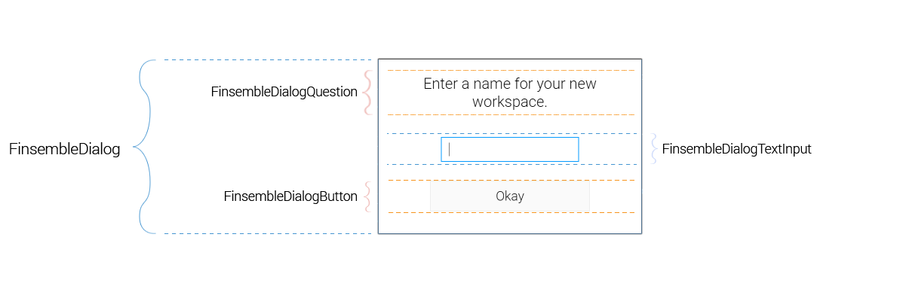

# FinsembleDialog

## Overview
The FinsembleDialog allows you to quickly assemble a functioning dialog, which is simply a Finsemble pop-up component that receives user input and transmits it to another window. It handles much of the communication with the `DialogManagerClient`, and allows you to focus on the contents of your dialog.

## Hierarchy
This control is actually part of a collection of controls. In order to make sure that your control has appropriate classes and styling, adhere to this hierarchy.

* **FinsembleDialog**
    * [FinsembleDialogQuestion](../FinsembleDialogQuestion/README.md)
    * [FinsembleDialogTextInput](../FinsembleDialogTextInput/README.md)
    * [FinsembleDialogButton](../FinsembleDialogButton/README.md)



### Communication flow


The dialog is opened by another component, referred to in the diagram above as the opener. The opener sends an open request, along with initialization data. `onShowRequested` is invoked as the query response to `DialogManagerClient.open`. **After the dialog receives initialization data and does what it needs to, it must call `DialogManagerClient.showDialog`**. At this point, the opener will move the dialog to the correct monitor and begin waiting for user input. When the user interacts with the dialog, the dialog must send data back to the opener via `DialogManagerClient.respondToOpener`.

The prop `behaviorOnResponse` just tells the dialog whether it should hide or close itself after it sends data back to the opener. To make this more concrete, let's look at some example code from our default "Yes/No" dialog. This dialog has a question, a yes button, a no button, and a cancel button. The example below is the dialog that pops up asking the user if they'd like to save their active workspace.
## Example Code
The code below shows a basic level of what you might need to have a funcitoning opener/dialog relationship. To see a full fledged example, see our sample 'yesNoDialog' in the finsemble-seed repo.

### Code in the opener
```javascript
//My yes/No dialog is expecting a question as a parameter in the call to open it.
let dialogParams = {
    question: 'Your workspace has unsaved changes, would you like to save them?'
}
//This function is invoked once the user interacts with the dialog.
let onUserInput = function(err, response){
  if (response.choice === 'affirmative') {
        FSBL.Clients.WorkspaceClient.saveAs({
            force: true,
            name: FSBL.Clients.WorkspaceClient.activeWorkspace.name
        }, function (err1, response1) {
            resolve(response.choice);
        });
    } else {
        resolve(response.choice);
    }
}
FSBL.Clients.DialogManager.open('yesNo', dialogParams, onUserInput);
```

### Code in the dialog
```javascript

    //When `FSBL.Clients.DialogManager.open` is called, this function receives the initialization data.
	onShowRequested(err, response) {
		let data = response.data;
		this.setState({
			question: data.question,
			negativeResponseLabel: data.negativeResponseLabel || 'No',
			affirmativeResponseLabel: data.affirmativeResponseLabel || 'Yes',
			cancelResponseLabel: data.cancelResponseLabel || 'Cancel',
			showNegativeButton: typeof data.showNegativeButton === 'undefined' ? true : data.showNegativeButton,
			showAffirmativeButton: typeof data.showAffirmativeButton === 'undefined' ? true : data.showAffirmativeButton,
			showCancelButton: typeof data.showCancelButton === 'undefined' ? true : data.showCancelButton,
		}, this.fitAndShow);
	}
    //Combined method that calls fitToDOM and then showDialog. Could be split into two functions, but decided against that.
	fitAndShow() {
        //FitToDOM is a helper that will calculate the height and width of all DOM Elements and fit the openFin around it.
		FSBL.Clients.WindowClient.fitToDOM(null, function () {
            //This function tells the opener to go ahead and show the dialog.
			FSBL.Clients.DialogManager.showDialog();
		});
	}

    //Sends user input back to the opener.
	sendResponse(response) {
		FSBL.Clients.DialogManager.respondToOpener({
			choice: response
		});
	}

```
## Props
| Prop               	| Type     	        | Possible Values | Default Value | Description |
|--------------	        |----------------	|-------------	  | ------------- | -------------	|
| isModal            	| boolean  	| `true, false`                            	| `false`       	| Whether to place a semi-transparent, black modal behind the dialog when it renders. This modal will cover all monitors. It can be hidden via user action on the dialog _or_ by the user clicking it and pressing `Escape`. |
| behaviorOnResponse 	| string   	| `'hide', 'close'`                        	| `'hide'`      	| Whether to hide or close the dialog after the user responds. The default behavior is to hide the dialog and move it around, reusing it. Generally, repurposing compoents like this is more performant than spawning them when they're needed. |
| onShowRequested    	| function 	| `function`                               	| `null`        	| This function is invoked whenever a dialog opener requests the dialog to show itself. Use this if you need to perform any async operations (e.g., re-rendering your dialog) prior to showing the dialog. **In your implementation of `onShowRequested`, you must invoke `FSBL.Clients.DialogManagerClient.showDialog`, or your dialog will remain hidden.** |
| userInputTimeout   	| number   	| N/A                                      	| 10000         	| This is the amount of time that the opener will wait before printing a `console.warn` stating that the dialog has yet to respond. |
