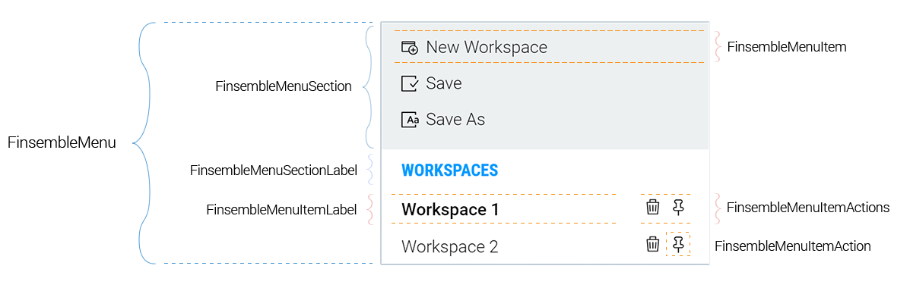

# FinsembleMenuItemAction

## Hierarchy
This control is part of a collection of controls. In order to make sure that your Menu component has appropriate classes and styling, adhere to this hierarchy.

* [FinsembleMenu](../FinsembleMenu/README.md)
    * [FinsembleMenuSection](../FinsembleMenuSection/README.md)
        * [FinsembleMenuSectionLabel](../FinsembleMenuSectionLabel/README.md)
        * [FinsembleMenuItem](../FinsembleMenuItem/README.md)
            * [FinsembleMenuItemLabel](../FinsembleMenuItemLabel/README.md)
            * [FinsembleMenuItemActions](../FinsembleMenuItemActions/README.md)
                * **FinsembleMenuItemAction**

## Overview
The MenuItemAction is just a button inside of the MenuItemActions wrapper. It provides classes so that it looks nice; otherwise it's just a generic button.

## Props
| Prop               	| Type     	        | Possible Values | Default Value | Description |
|--------------	        |----------------	|-------------	  | ------------- | -------------	|
| className       | string    | N/A                                               | `null`  | Class name for the menuItemAction component. |
| children | ? |
