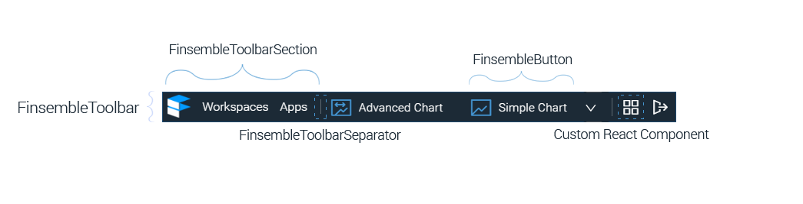

# FinsembleToolbar

## Overview
This is a container designed to be a toolbar. The FinsembleToolbar is made up of [FinsembleToolbarSections](../FinsembleToolbarSection/FinsembleToolbarSection.md) and each section  contains other components or controls. Generally these are composed from [FinsembleButtons](../FinsembleButton/FinsembleButton.md). A [separator control](../FinsembleButton/FinsembleButton.md) is also available and you have the ability to use any custom controls.



## Props

Currently, this has no props.

## Example

See our sample Toolbar component (TODO: Link) for a working example.

```jsx
<FinsembleToolbar>
	<FinsembleToolbarSection {...sectionProps1}>
		<FinsembleButton {...buttonProps1}>
		</FinsembleButton>
		...
	</FinsembleToolbarSection>
	<FinsembleToolbarSection {...sectionProps2}>
		<FinsembleButton {...buttonProps2}>
		</FinsembleButton>
		...
	</FinsembleToolbarSection>
	...
</FinsembleToolbar>
```